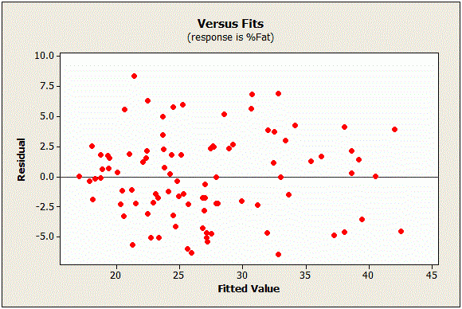

### Análisis de la regresión lineal
Un modelo de regresión lineal (RL) se analiza con los estadisticos P y coeficiente de regresión.

#### Interpretación del valor de P en una regresión lineal
Los valores de P y coeficientes de regresión en un modelo de regresión juntos explican que variables en el modelo son estadísticamente significativas y la naturaleza de la variable con la variable dependiente. El coeficiente de regresión describe matemáticamente la relación entre la variable predictora (variable independiente - X) y la variable predicha (variable dependiente - Y). El valor de P indica si la relación X-Y es estadísticamente significativa.
Después de hacer el ajuste del modelo de regresión, se recomienda verificar el gráfico de los valores residuales para evaluar que no haya estimados con sesgo. Luego evaluar los estadísticos del modelo (valores de P y coeficientes de regresión).

Tomado de: https://statisticsbyjim.com/regression/check-residual-plots-regression-analysis/

El valor de P determina si la relación entre la variable independiente y dependiente (X-Y) observada con la muestra también existe en la población. El valor de P de cada variable independiente prueba la hipótesis nula que la variable no tiene correlación con la variable dependiente. Si no existe correlación entre X y Y, no hay asociación de los cambios en X con los cambios en Y. Se puede concluir entonces que no hay suficiente evidencia para afirmar que un efecto de X sobre Y a nivel de la población. Por ejemplo, si el nivel de significancia es a = 0.05, tenemos:

-	Si P < 0.05, la muestra provee suficiente evidencia para rechazar la hipótesis nula para la población. La variable X favorece a la hipótesis de que hay una no-cero correlación X-Y. Es decir, cambios en X están asociados con cambios en Y a nivel de la población. Esta variable es estadísticamente significativa y probablemente vale la pena incluir en el modelo de RL.
-	Si P > 0.05, la muestra no da suficiente evidencia para concluir una no-cero correlación X-Y.
En el siguiente ejemplo, las variables South y North son estadísticamente significativas porque sus valores de P son menores a 0.05. Mientras que la variable East no es significativa porque P > 0.05.
 
El valor de P también se emplea para decidir que variables considerar en el modelo de RL final. Las variables cuyos valores de P son mayores al nivel de significancia generalmente son removidos del modelo de RL. Mantener variables estadísticamente no significativas (con P > 0.05) pueden reducir la precisión del modelo de RL.

